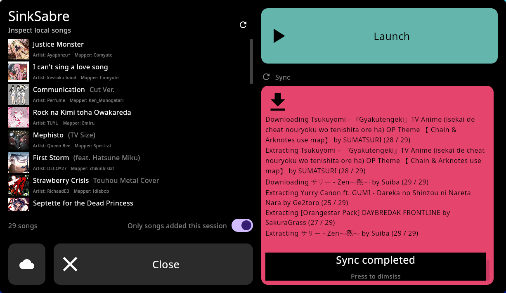
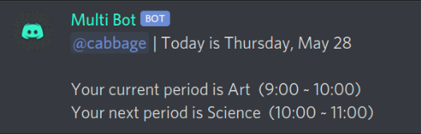

<picture>

</picture>

# Hello World!

<picture>
  
</picture>

<picture>
  
</picture>

<br>

I make stuff for fun and put it on the Internet. I've been programming on and off (but mostly on) since teaching myself Python in 2019.

<details>
  <summary><h3>A timeline of my projects</h3></summary>

### 2024

---

<div>
  <picture>
    
  </picture>

  ### [SinkSabre](https://github.com/toasterofbread/sinksabre)
  The solution I was using to transfer Beat Saber maps onto my Quest (SinkSaber) was suddenly removed one day, so naturally I had to implement a solution myself.

  I used Compose Multiplatform again, and it was really satisfying to reuse [code I'd originally written for SpMp](https://github.com/toasterofbread/spmp) and see how quickly I could put the UI together.

  This is probably the first legitimately useful project (not including small scripts) that I've put together and fully completed, and I did it in just 5 days.
</div>

<br>
<br>
<br>

### [mediasession-kt](https://github.com/toasterofbread/mediasession-kt)

While looking for a way to add OS media session integration to SpMp, I did find a working Java library, but I wanted a solution that would also work with [spmp-server](https://github.com/toasterofbread/spmp-server) (which uses Kotlin/Native), so I implemented the DBus MPRIS protocol myself.

### [ytm-kt](https://github.com/toasterofbread/ytm-kt)

A developer in the SpMp Discord who was creating their own music app mentioned they were looking at SpMp's code for interfacing with YouTube's API but didn't like that it was mixed with UI code in some places.

I'd been planning on making the API code into its own library anyway, so I offered to get the project started. It took me about a week to separate and clean the code, and add some (very) basic documentation and a sample file.

### 2022
---

<div>
  <picture>
    
  </picture>
  <picture>
    
  </picture>

  ### [SpMp](https://github.com/toasterofbread/spmp) (ongoing)
  A YouTube Music client for both Android and Linux I've been making since August 2022 using Compose Multiplatform.
  I've implemented useful queue manipulation features, as well as language and metadata customisation options.
  
  Seeing poor song title translations on a daily basis in the official app and not being able to change them was a great motivator.
</div>

<br>
<br>
<br>
<br>
<br>
<br>

<div>
  <picture>
    
  </picture>

  ### [RE](https://github.com/toasterofbread/RE)
  ```
  A basic 2D and 3D game engine I made as my first C++ project, including a basic voxel implementation.
  As far as the engine API goes, it's basically a remake of Godot.
  I ported this project to the PS Vita at one point, but I can't remember how to get through the dependency hell to rebuild it now.
  ```
</div>

<br>
<br>

<div>
  <picture>
    
  </picture>

  ### [Kakutroid](https://github.com/toasterofbread/Kakutroid)
  ```
  A Metroidvania with simple geometric graphics and Celeste-inspired movement.
  Another project I planned to finish and release but was never able to, although this got much closer than Dino.
  I will probably revisit this idea/project at some point.
  ```
</div>

<br>
<br>
<br>

### 2021
---

<div>
  <picture>
    
  </picture>

  ### [Game Off 2021 entry](https://github.com/toasterofbread/Game-Off-2021)
  ```
  A project I started as an entry to the 2021 Github Game Off, involving an in-game scripting language.
  Implementing a language in GDScript was a lot harder than I had expected, but I was able to get basic logic, functions, and variables working.
  It became clear pretty quickly that I wouldn't finish it in time for submission, but it was still worth it for the experience.
  ```
</div>

<br>
<br>

<div>
  <picture>
    
  </picture>

  ### [Untitled Dino Game](https://github.com/toasterofbread/Untitled-Dino-Game)
  ```
  A simple p2p infinite runner game I made in Godot in about a week.
  This was the first project I started with the intent to actually complete and release it.
  My motivation for the runner idea didn't last for very long though.
  ```
</div>

<br>
<br>

<div>
  <picture>
    
  </picture>

  ### [Metroid in Godot (again)](https://github.com/toasterofbread/godot-metroid-engine)
  ```
  My third (and so far most recent) crack at a 2D Metroid game in Godot.
  This time I actually completed all of Samus's mechanics (including grapple and spider).
  Then I moved on to fun things like menu UI, levels, and enemies.

  The second attempt died after a single week because I spent hours thinking about the story instead of planning the software.
  ```
</div>

<br>

### 2020
---

<div>
  <picture>
    
  </picture>
  
  ### [Super Metroid in Godot](https://github.com/toasterofbread/original-metroid-engine)
  ```
  A remake of Super Metroid's Samus using the original assets.
  The first project I created with the Godot Engine over the course of about two weeks in summer 2020.
  All the basic movement mechanics from Super are implemented, except the grapple beam.
  Metroid projects are a running theme for me, apparently.
  ```
</div>  

<br>
<br>

<div>
  <picture>
    
  </picture>
  
  ### [MultiBot](https://github.com/toasterofbread/Multi-Bot-Rewrite)
  ```
  A multi-purpose Discord bot I built after practicing with smaller bot projects in 2019.
  Has a variety of features including timetables, weather, and music playback.
  ```
</div>

### 2019
---

##### - Various Python Discord bots
##### - Python command-line calculator

<br>
<br>
<br>

</details>

##

<p align="center">
  <picture>
    
  </picture>
  <picture>
    
  </picture>
</p>
