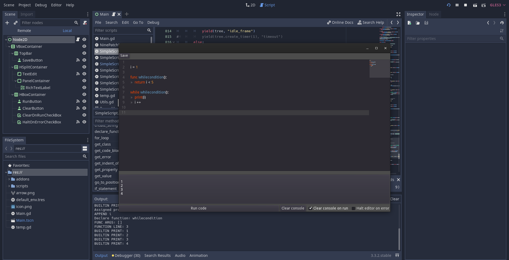
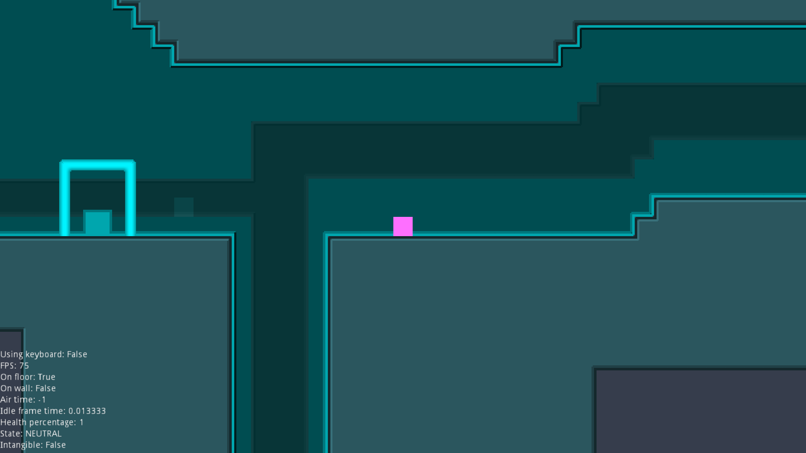
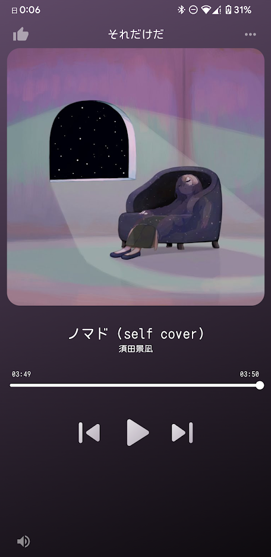
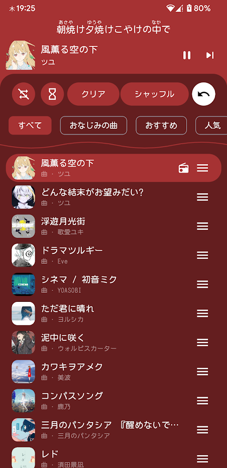

<picture>

</picture>

# Hello World!

<picture>
  
</picture>

<picture>
  
</picture>

<br>

I make stuff for fun and put it on the Internet. I've been programming on and off (but mostly on) since teaching myself Python in 2019.

<br>

<details open>
  <summary><h2>A timeline of my projects</h2></summary>

### 2020
---

<div>
  <picture>
    
  </picture>
  
  ### [Super Metroid in Godot](https://github.com/toasterofbread/original-metroid-engine)
  ```
  A remake of Super Metroid's Samus using the original assets.
  The first project I created with the Godot Engine over the course of about two weeks in summer 2020.
  All the basic movement mechanics from Super are implemented, except the grapple beam.
  Metroid projects are a running theme for me, apparently.
  ```
</div>  

<br>
<br>

### 2021
---

<div>
  <picture>
    
  </picture>

  ### [Metroid in Godot (again)](https://github.com/toasterofbread/godot-metroid-engine)
  ```
  My third (and so far most recent) crack at a 2D Metroid game in Godot.
  This time I actually completed all of Samus's mechanics (including grapple and spider this time).
  Then I moved on to fun things like menu UI, levels, and enemies.

  The second attempt died after a single week because I spent hours thinking about the story instead of planning the software.
  ```
</div>

<br>

<div>
  <picture>
    
  </picture>

  ### [Untitled Dino Game](https://github.com/toasterofbread/Untitled-Dino-Game)
  ```

  ```
</div>

<br>
<br>
<br>
<br>

<div>
  <picture>
    
  </picture>

  ### [Game Off 2021 entry](https://github.com/toasterofbread/Game-Off-2021)
  ```

  ```
</div>

<br>
<br>
<br>
<br>
<br>

### 2022
---

<div>
  <picture>
    
  </picture>

  ### [Kakutroid](https://github.com/toasterofbread/Kakutroid)
  ```
  
  ```
</div>

<br>
<br>
<br>
<br>

<div>
  <picture>
    
  </picture>

  ### [RE](https://github.com/toasterofbread/RE)
  ```
  A basic 2D and 3D game engine I made as my first C++ project, including a basic voxel implementation.
  As far as the engine API goes, it's basically a remake of Godot.
  I ported this project to the PS Vita at one point, but I can't remember how to get through the dependency hell to rebuild it now.
  ```
</div>

<br>
<br>
<br>

### 2022 / 2023
---

<div>
  <picture>
    
  </picture>
  <picture>
    
  </picture>

  ### [SpMp](https://github.com/toasterofbread/spmp)
  ```
  A YouTube Music client I'm currently making with a focus on language and metadata customisation.
  Seeing poor song title translations on a daily basis in the official app and not being able to change them was a great motivator.
  
  ```
</div>

<br>
<br>
<br>
<br>
<br>
<br>

</details>

##

<p align="center">
  <picture>
    
  </picture>
  <picture>
    
  </picture>
</p>
